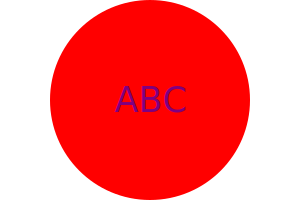
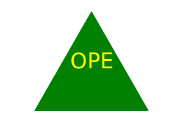

# 10-Logo-Generator

## Description

  A logo generator created using inquirer and node js. Utilizes jest to test code. Command line application creates a logo by prompting the user to select a shape(circle, triangle, square or diamond), specify a color for the shape, enter up to 3 characters to appear within the selected shape, and select a color for the text. Application then produces an SVG file with the users input.
  
  

  
  
  
  
  
## Table of Contents

  1. [Installation](#installation)
  2. [Usage](#usage)
  3. [License](#license)
  4. [Contribution](#contribution)
  5. [Testing](#testing)

## Installation

  n/a

## Usage

  n/a

## License

  None

## Contribution

  n/a

## Testing

  npm install --save-dev jest\
  npm test

## Questions
  Email me at [abilivick@gmail.com](mailto:abilivick@gmail.com) or explore more projects at [lailiel](https://www.github.com/lailiel)
